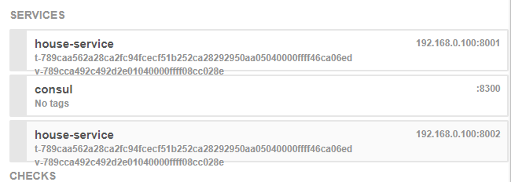
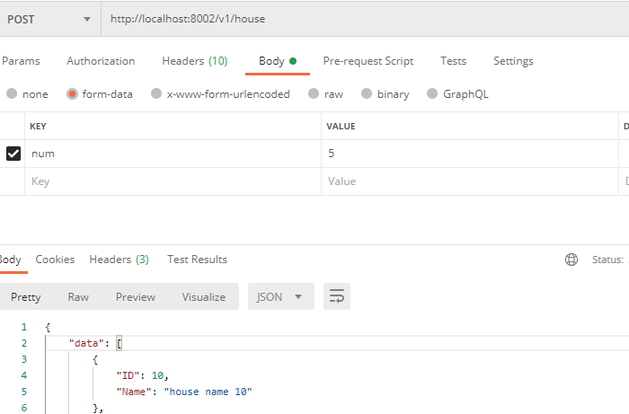

# demo03: http demo

## http 标准库
go-micro 结合 golang 自带的标准库 net/http，提供 http 服务

http/main.go 主要代码：
```go
server := web.NewService(
    web.Address(":8080"), // http 端口
)
server.HandleFunc("/hello", func(w http.ResponseWriter, r *http.Request) {
    w.Write([]byte("hello Go-Micro world"))
})

if err := server.Run(); err != nil {
    log.Println(err.Error())
}
```

运行：go run main.go

在浏览器上运行：http://localhost:8080/hello

就会显示：hello Go-Micro world

## gin

既然能结合 go 标准库，那么自然也能跟 gin 结合使用。

gin/main.go 主要代码：
```go
// gin 作为路由
r := gin.Default()
r.GET("/hello", func(ctx *gin.Context) {
    ctx.String(http.StatusOK, "hello gin!")
})

// 初始化一些数据
server := web.NewService(
    web.Address(":8080"),  // http 端口
    web.Metadata(map[string]string{"data": "hello world"}), // 可以携带一些信息
    web.Handler(r), // gin 路由
)

// 运行
if err := server.Run(); err != nil {
    log.Println(err.Error())
}
```
运行：go run main.go

在浏览器上运行：http://localhost:8080/hello

就会显示：hello gin!

## gin2

写一个复杂点的例子，consul 作为注册中心存放服务。

1. 编写 service/house.go ，一个简单服务定义，定义建房子服务。

2. 编写服务端处理程序 server/main.go
传递的参数是 body 里 form 形式，当然也可以是 url 参数形式。

这里的 http 运行端口，在终端来指定：
```shell script
go run server/main.go --server_address :8001
go run server/main.go --server_address :8002
```
上面运行了 2 个 http服务。后面注册端口，完整的地址是 192.168.0.1:8001，如果省略了前面的 ip 地址，就默认获取本地ip地址。

看看 consul 里的：


用测试工具测试下，比如 postman 工具，这里 Body 选择 form-data 形式，然后填上 num ，5，
点击运行，就会输出下面的数据：

```json
{
    "data": [
        {
            "ID": 10,
            "Name": "house name 10"
        },
        {
            "ID": 11,
            "Name": "house name 11"
        },
        {
            "ID": 12,
            "Name": "house name 12"
        },
        {
            "ID": 13,
            "Name": "house name 13"
        },
        {
            "ID": 14,
            "Name": "house name 14"
        }
    ],
    "msg": "success"
}
```


3. 写一个客户端程序：

   用客户端程序来随机选择一个服务地址，然后发起 http 请求。

   client/main.go

   详细代码见 github。
   
   运行程序：go run client/main.go ， 多运行几次，就会随机出现 8001,8002 的服务
```shell script
 go run .\main.go
 f27b74d9-b437-4cd5-a25e-620d9336f4b8 map[protocol:http] 192.168.0.100:8002
 
 map[data:[map[ID:10 Name:house name 10] map[ID:11 Name:house name 11] map[ID:12 Name:house name 12] map[ID:13 Name:house name 13] map[ID:14 Name:house name 14]] msg:success]
```
   
   
   