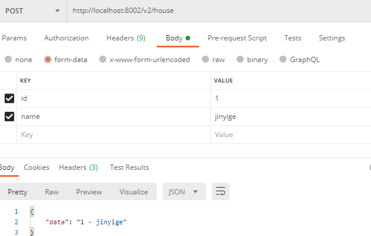
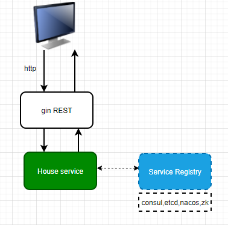

# demo03: http demo

## http 标准库
go-micro 结合 golang 自带的标准库 net/http，提供 http 服务

http/main.go 主要代码：
```go
server := web.NewService(
    web.Address(":8080"), // http 端口
)
server.HandleFunc("/hello", func(w http.ResponseWriter, r *http.Request) {
    w.Write([]byte("hello Go-Micro world"))
})

if err := server.Run(); err != nil {
    log.Println(err.Error())
}
```

运行：go run main.go

在浏览器上运行：http://localhost:8080/hello

就会显示：hello Go-Micro world

## gin

既然能结合 go 标准库，那么自然也能跟 gin 结合使用。

gin/main.go 主要代码：
```go
// gin 作为路由
r := gin.Default()
r.GET("/hello", func(ctx *gin.Context) {
    ctx.String(http.StatusOK, "hello gin!")
})

// 初始化一些数据
server := web.NewService(
    web.Address(":8080"),  // http 端口
    web.Metadata(map[string]string{"data": "hello world"}), // 可以携带一些信息
    web.Handler(r), // gin 路由
)

// 运行
if err := server.Run(); err != nil {
    log.Println(err.Error())
}
```
运行：go run main.go

在浏览器上运行：http://localhost:8080/hello

就会显示：hello gin!

## gin2

结合 consul 写一个复杂点的例子，用 consul 作为注册服务中心存放服务。
先启动 consul 服务， `consul agent --dev`

1. 编写 service/house.go ，一个简单结构定义，定义一个房子结构，然后一些操作。

2. 编写服务端处理程序 server/main.go 。

  

运行服务端程序，http 运行端口在终端命令行来指定：
```shell script
go run server/main.go --server_address :8001
go run server/main.go --server_address :8002
```
上面运行了 2 个 http 服务。后面是http服务注册的端口。完整地址应该是 192.168.0.100:8001，如果省略了前面的 ip 地址，就默认获取本地 ip 地址。

看看 consul 里的服务：


用测试工具测试，比如 postman 工具，这里 Body 选择 form-data 形式，然后填上 num ，5，
点击运行，就会输出下面的数据：

```json
{
    "data": [
        {
            "ID": 1,
            "Name": "house name 1",
            "Floor": 10,
        },
        {
            "ID": 2,
            "Name": "house name 2",
             "Floor": 10,
        },
        {
            "ID": 3,
            "Name": "house name 3",
             "Floor": 10,
        },
        {
            "ID": 4,
            "Name": "house name 4",
        },
        {
            "ID": 5,
            "Name": "house name 5",
             "Floor": 10,
        }
    ],
    "msg": "success"
}
```


测试路由 v2 ：

同样可以在 postman 上测试，

测试 v2 GET， http://localhost:8002/v2/house/onehouse，返回如下数据：

   ```shell script
[GET] req name: %!(EXTRA string=onehouse)
   ```


测试 v2 POST， http://localhost:8002/v2/house ， 如下：




3. 客户端程序请求：

   用客户端程序来随机选择一个服务地址，然后发起 http 请求。我们用 go-micro 插件里的 http (github.com/micro/go-plugins/client/http/v2) 请求服务，轮询来请求服务。

   ```go
mySelector := selector.NewSelector(
       // 服务注册中心地址
       selector.Registry(consulReg),
       // 选择轮询算法
       selector.SetStrategy(selector.RoundRobin),
   )
   
   newClient := microhttp.NewClient(
       client.Selector(mySelector),
       client.ContentType("application/json"),
   )
   ```
   
   gin2/client/main.go
   
   详细代码见 github。
   
   
   
   运行程序：go run client/main.go ， 多运行几次，就会随机出现 8001,8002 的服务
```shell script
 go run .\main.go
 f27b74d9-b437-4cd5-a25e-620d9336f4b8 map[protocol:http] 192.168.0.100:8002
 
 map[data:[map[ID:1 Name:house name 1 Floor:10] map[ID:2 Name:house name 2 Floor:10] map[ID:3 Name:house name 3 Floor:10] map[ID:4 Name:house name 4 Floor:10] map[ID:5 Name:house name 5 Floor:10]] msg:success]
```

   

## 访问图

最后来一张访问图，看的就比较清楚了：

